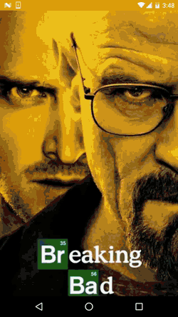

# Show Time App

This application uses [The Movie DB](https://www.themoviedb.org/documentation/api) api in order to show most popular **movies** and **tv shows**.

The project was an exploration of 
- Material Design 
- Activity launch [animations](https://github.com/lgvalle/Material-Animations)
- Custom status bar and over scroll colors ( media detail page )

You can download the [apk here](https://github.com/aleksandrTmk/ShowTime/blob/master/assets/app-debug.apk?raw=true).

Apologies for low quality gif.

